# 基础安装
当前安装 NASTool 版本为 2.7.1， 其他版本可过程基本一致。

## 环境
目前我的黑群晖 DSM 7.1.1-42962。

## 安装
安装之前，需要提前安装 `Python 3.9或以上版本`， 我们直接到套件中心搜索并安装。

然后添加矿神的套件来源，在`套件中心 > 设置 > 套件来源`中，新增套件来源。位置填写`https://spk7.imnks.com/`。

添加好后，搜索`NASTool`, 并安装。

安装成功后，点击打开，会跳转到`http://ip:3003`，默认用户密码：admin/password

登陆后，提示配置 TMDB API KEY 和 修改密码, 我们稍后再设置。

基础设置，建议修改一下用户名密码。

# 配置NAStool
配置TMDB API（用于Nastool媒体库中所有影视资源的刮削，获取海报、简介、演员表、上映年份等）

>设置"默认的文件转移方式"。也就是我们的文件从下载的位置 到 我们媒体库的一个转移方式。这几种方式在官方也有说明。其主要指我们下载的文件和 NASTool 整理后的文件的一种关联方式。一般需要保种的话需要我们原文件不动，也就是不能选择移动的模式了，具体的区别可以看原文的描述。
>
>我这里选择的是复制，我用一块淘来的二手盘保种，然后将下载好的电影整理后自动复制到另一块盘中，作为媒体库。如果你不希望占用两份存储空间，而且目录是在同一个存储池中，可以使用硬链接的方式。 当然如果你不需要保种，可以直接选择移动模式。其他两种模式目前没需求，没有详细研究，有兴趣可以去折腾一下。

配置豆瓣远程订阅 （豆瓣APP点击想看后，nastool会自动搜索下载对应的电影或者电视剧）

配置pushplus推送（用于NasTool的微信公众号消息推送） 

# 下载器设置（qb）
NASTool 的下载器支持`qBittorrent/Transmission/115网盘/Aria2`，我这里使用qb，你也可以切换其他的。直接到套件中心搜索并安装。

打开后自动跳转到`http://ip:8085`, 默认账号密码`admin / adminadmin`

如果是BT用户，我们来修改一下下载文件夹就好了。个人建议的话，分个类，方便管理。我准备将下载的电影放到我的Download文件夹中，我创建了一个movie, 一个tv的分类，分别用户放电影和电视剧。

SSH 登陆，找到我们刚刚的目录，一般我们创建的存储池都在`/volume`开头的文件夹下面，我们可以利用`ls /volume*`列出所有的，然后找一下我们的目录在哪。如下图所示，我的目录在`/volume2/`下面。

这样我这里的下载地址就是`/volume2/Download/movie`和`/volume2/Download/tv`。

默认路径修改一下。

然后添加两个分类。

PT的用户需要`DHT`啥的关掉，我这里就不多说了，如果你是玩PT的你应该早就设置过。

然后我们到NASTool中`设置 > 下载器`中设置一下。

设置好地址端口，用户名密码，点击一下测试，如果是测试成功就好了。

设置一下下载目录

如果你的和我的一样显示无权限，我们需要去设置一下。

进入`File Station`, 在你需要设置的文件夹上，点击`属性`。

权限这里，把全部勾选上，同时`用户或组`这里选上 NASTool。

再次回到NASTool , 我们发现这里已经可以选择了。

# Nastool的使用教程

# 媒体服务器设置 (Jellyfin）
需要先添加社区套件源`https://packages.synocommunity.com/`

然后搜索安装

还有个许可协议，同意一下。

然后下一步，下一步就好了。安装完成后打开，跳转`http://ip:8096`。
设置汉语。

用户名密码什么的配置一下。

媒体库暂时不设置，直接下一步。

国家地区设置一下。

然后下一步，下一步设置完成。最后登陆一下。

到`设置>控制台>API`密钥中，添加API密钥。

名称随意，添加完成后复制API密钥到 NASTool 中添加。

然后到 NASTool, `设置>媒体服务器>Jellyfin`中设置。

填好API密钥，并测试一下，显示测试成功就好了。

# 媒体库设置
在`设置>媒体库`中，设置我们的整理好后的电影的存放目录。

如果和我一样出现权限不足的，我们就需要去添加一下权限。 和之前差不多，在`File Station`中找到文件夹，分配一下权限。这里同时把 jellyfin ffmpeg 的权限都给上了。同时应用到了子文件夹。

然后你就可以正常添加了。

## 目录同步
这个就是我们下载目录 和 媒体库目录的同步设置。

源目录是我们的下载目录，目的目录是我的媒体库目录。

# Jefflyfin 媒体库设置
最后，我们到 Jeffyfin 这边也设置一下媒体库。在媒体库中直接输入文件夹添加。

同时媒体资料存储方式勾选上`Nfo`。

点击添加后成功添加。

如果支持硬解码，在播放中把硬解码开启。

# 测试
## 下载电影
随便在推荐中找个电影下载测试一下。如我这里下载一个

点开后出现简介。

点击搜索开始搜索。

完成搜索后的结果展示。

选择一个资源下载

提示成功。

到下载管理中可以看到正在下载的。

下载完成后就自动重命名以及归类了。

在Jellyfin中就可以看到了。

简介内容。

## 订阅场景
找到你想看到电视剧或电影，点击订阅。

你订阅的就会出现在订阅管理中。

如果有更新，qb中会自动下载。

后面就是自动归类，可以愉快的观影啦。

# 安装索引器
既然更新了，再安装个强大的索引器`Jackett`。
如果不想折腾的话，用内置的索引器一般是够用（需要安装有Chromium内核的版本）的。当然，想搜索更全，那可以安装一个`Jackett`索引器。
社群套件中已经有了，直接搜索安装。
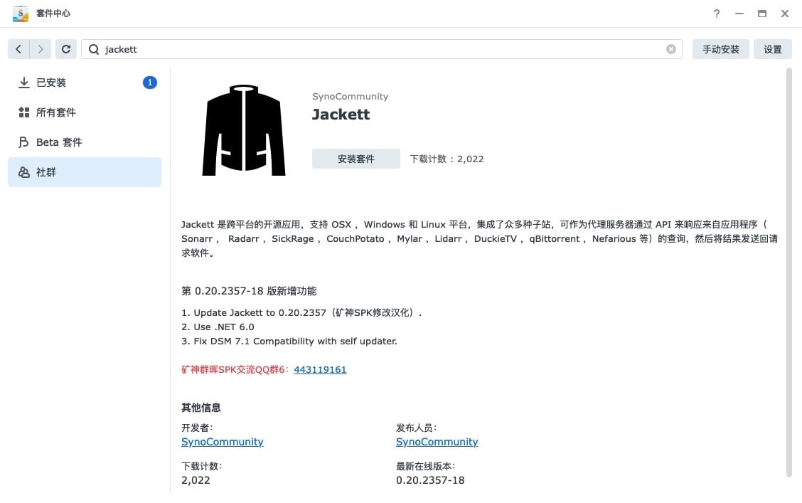

输入 `ip:9117` 打开 `Jackett`。
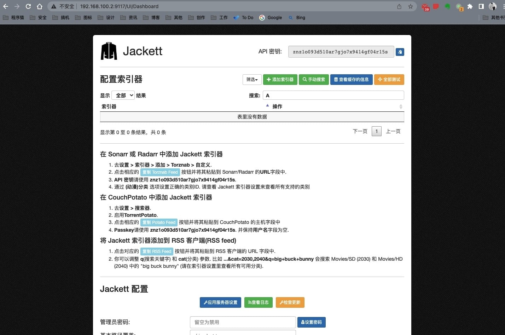

其他配置基本可以不用动，我们来配置一下 `FlareSolverr API`。为什么装这个服务呢？由于一些索引站点是受`Cloudflare` 等服务保护的，`Jackett`无法解决这个问题，然后就利用`FlareSolverr` 服务来解决这个问题。
当然你也可以不配置，大部分站点都不用。
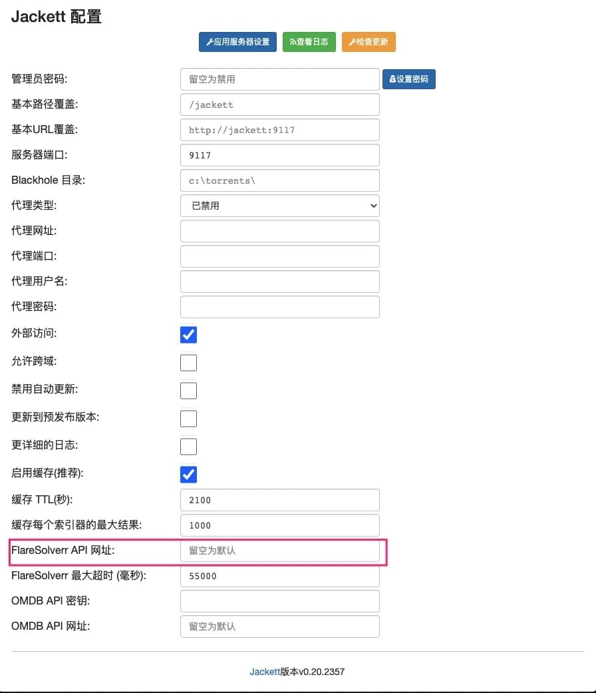

在`docker`中搜索`FlareSolverr`, 下载并安装。
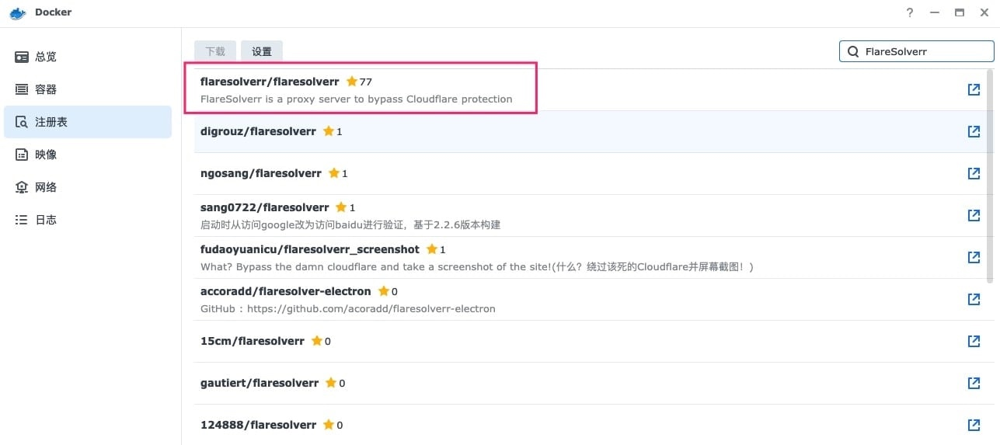

安装的时候记得加个环境变量`TEST_URL`, 启动的时候会连接这个地址来测试连通性，如果无法连通程序就无法启动。
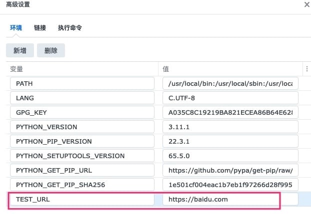

端口映射出来。然后下一步，下一步完成即可。
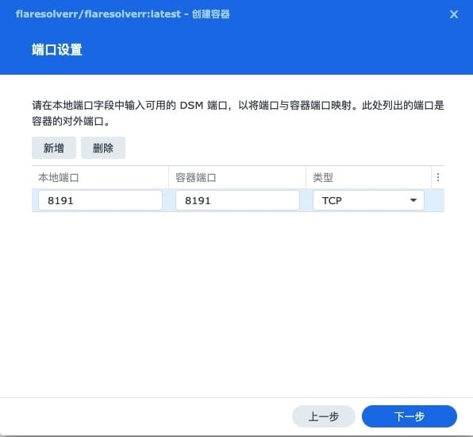

回到`Jackett中`添加地址。 套件安装的直接用`http://127.0.0.1:8191`就好。
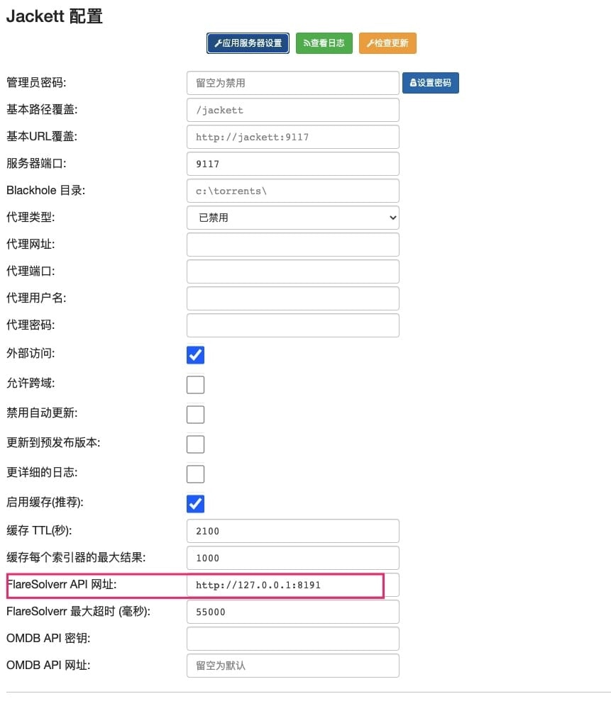

然后我们来添加索引器。

可以通过过滤，找自己需要的种类添加。
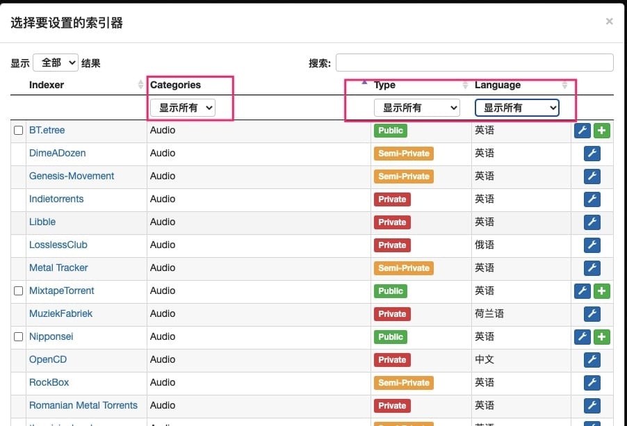

私有的，也就是PT，需要账号密码或者`Cookie`，如果你玩PT可以自己设置一下。 我这里加一些公开的站点。 不知道怎么选就全选吧。
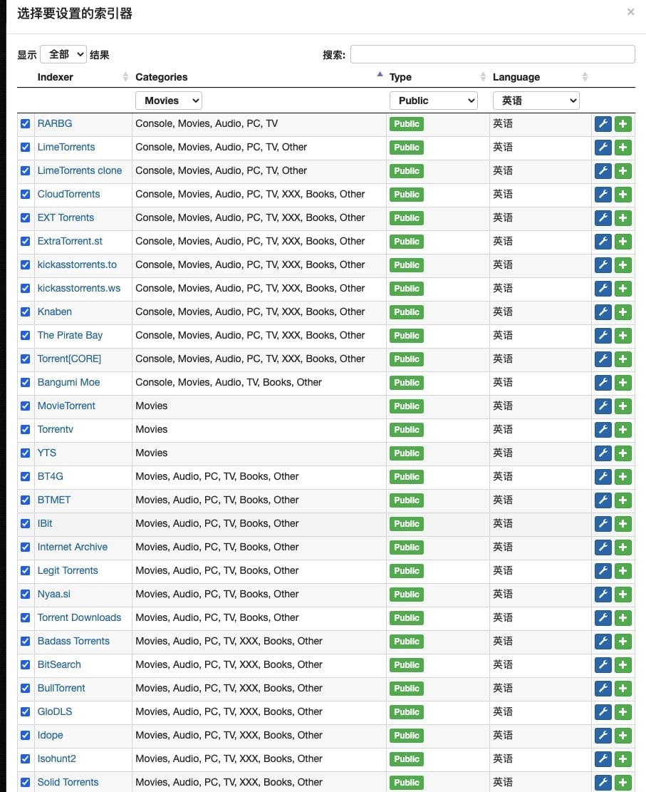

需要一点时间。

可以点击测试，把一些不通过的，删除了。
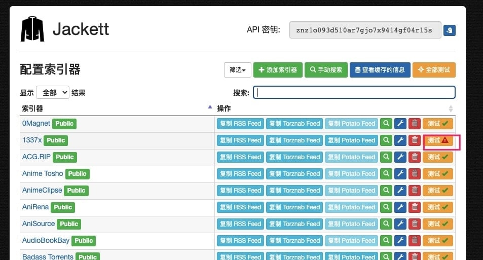

回到 NASTool, 添加API密钥。添加完成后测试一下是否可以连通。
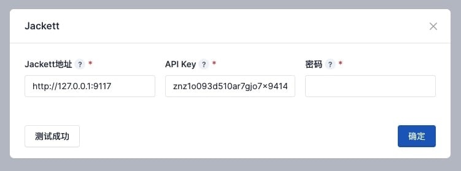

然后我们去搜索一下，确实很强。
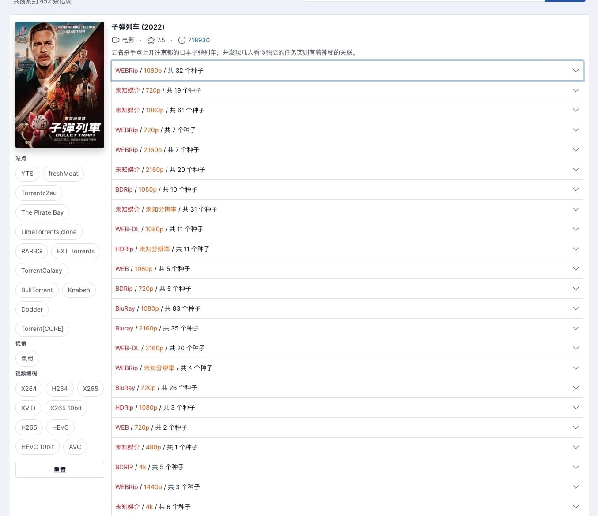

然后就可以开心的下载。


本文参考自以下博文，版权归原作者所有。

原文作者：phoenix338
原文地址：[全网最简单的Nastool一键部署教程，轻松实现Nastool、Qbittorrent、Jellyfin、Jackett、Transmission、TinyMediaManager全套软件的安装和配置](https://blog.csdn.net/weixin_66688931/article/details/136563912)

原文作者：Razeen
原文地址：[NAS折腾记(8)：群晖安装 NASTool 实现影音半自动化【多图】](https://razeen.me/posts/nas-10-nastool-install-and-basic-config/)
